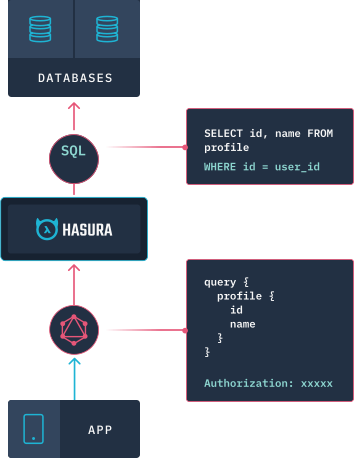
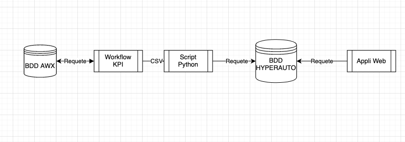
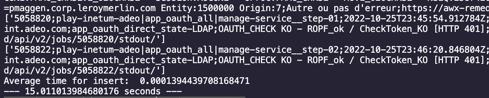

# Introduction :

### Contexte:

La mission dans laquelle Hatim et moi avons été affecté consiste à l’automatisation/remédiation de service sur les serveur de nos clients. Le processus d’automatisation/auto-remédiation se fait à l’aide de sondes qui “surveillent” les services. Lorsqu’un sonde est déclenchée, elle alerte la plateforme AWX qui va en fonction de la sonde, exécuter l’automate correspondant afin de régler le problème. Le dashboard d’AWX ne satisfaisant pas les envies de l’équipe, nous nous sommes proposé afin d’en produire un avec les attentes de chacun. Le projet étant assez complexe, il sera réalisé tout au long de notre contrat chez Inetum afin d’apporter une amélioration continue.

### Problématique:

L’objectif est de solliciter l’api d’AWX afin de récupérer toutes les informations nécessaires, les stocker ainsi que les afficher de façon compréhensibles. Nous nous sommes donc demandés comment automatiser la récupération de données à l’aide d’un playbook Ansible et rendre ces informations disponibles sur une application web ? 

Nous allons donc voir quelles technologies nous avons utilisé et pourquoi, la problématique concernant la confidentialité des bases de données des clients, les différentes solutions ainsi que sa mise en place et pour finir les limites de notre solution.

## Choix des technologies

Nous avons voulu découvrir de nouvelles technologies et c’est pour cela que nous nous sommes tournés vers GraphQL qui nous permettait de requêter d’une manière differente qu’avec une API REST, associé avec Hasura, nous gagnons du temps car la partie développement de l’API est automatiquement prise en charge par la solution. Cela nous a permit lors de notre requetage de ne demander que les champs dont nous avions besoin et donc de ne pas avoir à créer des endpoints et des requêtes personnalisés pour les différents éléments voulus.



GraphQL un langage de requêtes et un environnement d'exécution. La particularité de GraphQL est que la structure de la réponse du serveur est fixée par le client.

Comme l’exemple qu’on a en haut, le code présent à coté du logo de GraphQL, présente une requête qui va recuperer les champs “id” et “name” de la table “profile”, avec un champs Authorization en cas de besoin.

Hasura est un moteur GraphQL open source qui permet de déployer des API GraphQL instantanées et en temps réel sur n’importe quelle base de données Postgres. Ce qui nous a permis dans notre projet de recuperer des données à partir de notre base de données postgres rapidement en prenant en compte le nombre de données qu’on a.

## Methodologie:

La raison du projet etait que nous avions qu’un affichage de AWX insuffisant, nous avons donc transformé les resultats d’AWX en fichier CSV, mais cela n’etait pas attrayant et donc personne ne consultait le fichier .

### Methode utilisant un script python

La premiere methode consiste à requeter la base de données d’AWX afin d’y recuperer les KPI à l’aide d’un workflow lui meme executé à l’aide d’AWX,la requete sur la base de donnée ne selectionne que les workflow executé dans la journée.Le resultat du workflow sera ensuite stocké dans un csv que nous allons parser puis inserer chaque ligne du csv dans notre base de données afin de les afficher sur notre application web qui requete à l’aide de graphQL.

### Schema de la methode Python



*La base de données AWX sera requeté chaque jours à partir de 18h lorsqu’elle est moins solicité afin d’alleger sa charge de travail, le workflow produira un csv daté. Le script python est executé par un cron chaque jours à 20h et enverra les resultats dans la base de données de notre application web qui sera consultable par tout l’equipe.*

#### Explication des playbook ansible

**Meme procedé pour les jobs**

1er playbook: **kpi_workflows**

Le workflow se lance à une certaine heure, il prend 2 3 h pour se terminer et va iterer sur tout les workflows de j-1 à J

ensuite il crée un fichier csv ,stocke une “variable” 

appel api savoir le nombre de pages qu’il y a sur tout les workflows de la journée precedente. Si fichier csv existe deja on le supprime, creation du fichier avec toute les colonnes que l’on a besoin.Lancement du premier playbook avec include task, on le fait autant de fois qu’il y a de pages. Enlever les lignes vides du csv

2eme playbook: **iterate over pages**

appel get api.

On lui donne le numero de la page.

Appel a un autre playbook qui va iterer sur tout les workflows de la page de la page donnée

3eme playbook: **iterate over workflow**

Iterer sur les workflows un par un et va enregistrer la ligne dans une variable temporaire et on insere directement la variable sous forme de ligne

Ensuite le script python va tout entrer dans la BDD

```python
def main():
    connection = psycopg2.connect("host=localhost dbname=postgres user=postgres")
    cur = connection.cursor()
    #open kpis folder and read all csv Files
    requests_time = []
    for file in os.listdir("kpis"):
        if file.endswith(".csv"):
            with open("kpis/"+file
            ) as csvfile:
                reader = csv.reader(csvfile, delimiter=',')
                
                for row in reader:
                    print(row)
                    try:
                        row = row[0].split(';')
                        #workflow_id,workflow_name,workflow_started,workflow_finished,workflow_elapsed_time,workflow_status
                        started =time.time()
                        cur.execute("INSERT INTO workflowskpi(workflow_id,workflow_name,workflow_started,workflow_finished,workflow_elapsed_time,workflow_status) VALUES (%s,%s,%s,%s,%s,%s)",(row[0],row[1],row[2],row[3],row[4],row[5]))
                        requests_time.append(time.time()-started)
                    except Exception as e:
                        print(e)
                        pass
    connection.commit()
```

Le script python est directement mis dans le conteneur de la base de données, il insere ligne par ligne le contenu de chaque CSV produit dans la journée precedente, il retourne aussi dans des logs le temps pris pour l’execution du script ainsi que la moyenne du temps pris par la base de données pour chaque requete afin de comparer avec l’autre methode. 

### Coté Front:

Comme dit precedement, nous utilisons Hasura et GraphQL afin de requeter notre base, nous n’avons qu’une seule table nommé workflows et pour l’instant deux views qui nous permettent de recuperer le compte concernant les workflows reussi/fail.

```jsx
let typeErrorQuery = gql`
query typeErrorQuery{
kpi_job(where: {type_error: {_eq: "${searchBarValue.slice(1)}"}}) {
                         job_id
                         type_error
                         job_elapsed
                         job_started
                         job_finished
                         fqdn
                         probe_name
                         output_link
                         }
                         }
`;
```

Cette requête nous permet de récupérer les workflow ayant un type d’erreur que l’on aura tapé dans la barre de recherche. Comme on peut le voir les requêtes sont plus facilement compréhensibles et il est plus simple de choisir quels champs nous voulons récupérer, c’est l’un des avantages de GraphQL.

```jsx
query  {
        count_type_error {
            count
            type_error
        }

    }
```

*Requête qui permet de récupérer depuis la vue le nombre d’erreur pour chaque type d’erreur*

### Methode Full Ansible

Exactement la meme chose que la methode avec script python sauf que maintenant la variable stocké representant le workflow va etre directement envoyé par une requete sql donc plus besoin de la partie 

## Difficultés rencontrées

Nous avons rencontrés differents problemes durant le developpement du projet.

L’un des problemes rencontré est le deploiement du projet pour differents client,les données etant confidentielles, nous ne pouvions pas les garder sur notre reseaux et encore moins les melanger avec ceux d’autres clients à moins de les anonymiser nous avions deux possibilités.

### Solution multi-clients


# **Avantages:**

- Toutes les informations seront centralisées sur une seule application.
- L'ajout d'un client sera simplifié suivant ce schéma.

# **Inconvénients:**

- Le flux devra être sécurisé du début jusqu'à la fin (du client jusqu'aux instances cloud).
- Les clients seront perplexes à l'idée de voir leurs informations sur le cloud et/ou stocker avec les informations d'autres clients.
- Des requêtes vers l'extérieur seront à faire, les différents proxy et firewalls poseront donc problèmes.

### Solution mono client


# **Avantages:**

- Toutes les informations sont situées chez les clients (sur son réseau), la sécurité du flux n'est plus un problème pour notre équipe.
- Une infrastructure moins complexe à mettre en place.
- Le déploiement de l'application pour chaque client sera automatisé par une procédure.

# **Inconvénients:**

- Les informations de chaque client seront dispersées, pour un client il faudra donc se rendre sur le réseau interne de celui-ci pour consulter *HyperKPI*.

Pour ce probleme, nous avons decidé d’opter pour la solution monoclient afin de faciliter le deploiement de la bdd.

## Résultats

Le playbook ansible a été executé 3 fois afin de comparer les temps d’execution de la methode avec script python et la methode avec ansible.
Malheureusement, nous n’avons pas pu tester la methode avec ansible car le github lié a la plateforme AWX necessitait une autorisation tierce pour pouvoir push sur le repo, nous avons donc testé et estimé le temps d’execution de la methode avec ansible.
### Résultats de la méthode avec script python

Le playbook ansible avec le csv nous prennais en moyenne 1h13 pour s'executer et le script prenais seulement 13 secondes pour s'executer avec une moyenne de 0.0001 secondes par requete.
L'intérêt de cette méthode est donc de pouvoir executer le playbook ansible en tache de fond et de pouvoir lancer le script python quand on a besoin de mettre à jour la base de données.




### Résultats de la méthode full ansible

Le playbook ansible avec la requete sql nous prennait en moyenne 1h13 pour s'executer et une requete Insert nous prenait environ 6 secondes pour s'executer.
Avec plus de 4000 requetes à executer, cela prendrait environ 40 minutes pour mettre à jour la base de données.
Ceci est un temps d'execution théorique car nous n'avons pas pu tester la méthode avec ansible mais beaucoup plus long que la méthode avec script python.


## Conclusion

Nous avons pu voir que la methode avec script python est beaucoup plus rapide que la methode full ansible car elle permet de ne pas avoir à executer une requete sql pour chaque workflow.
Cependant, la methode full ansible est plus simple à mettre en place et à maintenir car il n'y a pas besoin de script python à executer en tache de fond.
Une amelioration possible serait d'executer dans le playbook ansible le script python a la fin afin de fusionner le playbook et le script python.
Le goulot d'étranglement dans les deux methodes ne sont pas notre base de donnée ou nos playbooks mais plutot la plateforme AWX ainsi que sa base de donnée puisqu'elle est utilisé par plusieurs equipes en meme temps et souvent surchargé.
Le projet n'etant qu'une preuve de concept, nous allons ameliorer tout le fonctionnement de nos playbooks afin de pouvoir les executer plus rapidement et de pouvoir les executer plus souvent.
on a pas pu tester completement la methode full ansible pcq mtn faut faire des pull request a chaque ligne de code que tu changes
du coup on a estimé avec ce qu'on avait fait avant